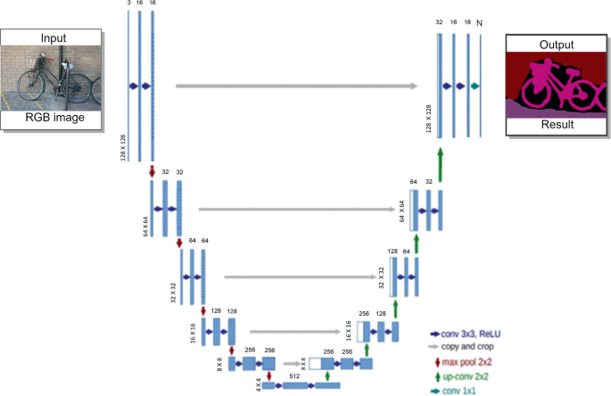

# Networks-Implementation

## 1. Fully Convolution Network (FCN-8, FCN-16, FCN-32)

## 2. Unet

## 3. ShelfNet

## 4. GoogleNet - IncevptionV1

## 5. ResNet50

## 6. VGG16

## 7. AlexNet

## 8. LeNet
